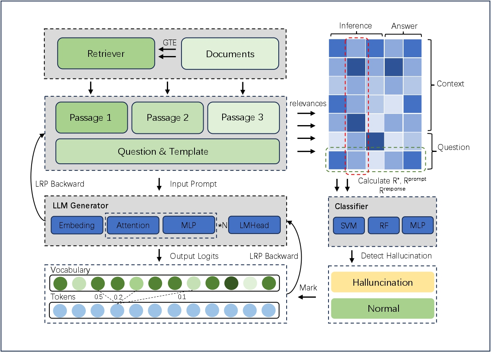

# RAG Hallucination Detecting By LRP

## Introduction
Using LRP-based methods to detect hallucination in RAG, this is code repository for "LRP4RAG: Detecting Hallucinations in Retrieval-Augmented Generation via Layer-wise Relevance Propagation".

#### What's LRP?
Layer-wise Relevance Propagation ([LRP](https://arxiv.org/abs/1604.00825)) is a technique that brings such explainability and scales to potentially highly complex deep neural networks.

#### Our Approach



## Structure
```
baseline: code to run baselines, including 3 baselines(SelfCheckGPT, Prompt LlaMA/GPT, Finetune)
baseline_output: intermediate results after running baselines
core: code for our approach, plus data analytics and visualization
data: raw data from RAG-Truth
lrp_result_llama_7b: LRP results for llama-2-7b-chat
lrp_result_llama_13b: LRP results for llama-2-13b-chat
pdf: visualization pdf
```
download baseline_output.zip lrp_result_llama_7b.zip lrp_result_llama_13b.zip from [NJUBox](https://box.nju.edu.cn/d/dfd5422c7ffc440ba875/)

## Usage
1. run `python core/llama_lrp.py` to get LRP results, which will be saved in `lrp_result_llama_7b`
2. run `python core/classifier.py --datasets ../lrp_result_llama_7b --classifier SVM` to get classification result of our approach

## Baselines
+ SelfCheckGPT: 
  + run `python baseline/self_checkgpt.py`
  + run `python baseline/self_check_result.py`

+ Prompt LlaMA/GPT:
  + run `python baseline/prompt_llama.py` / run `python baseline/prompt_gpt.py`
  + run `python baseline/prompt_llm_result.py` 

+ Finetune:
  + run `python baseline/llm_finetune.py`
